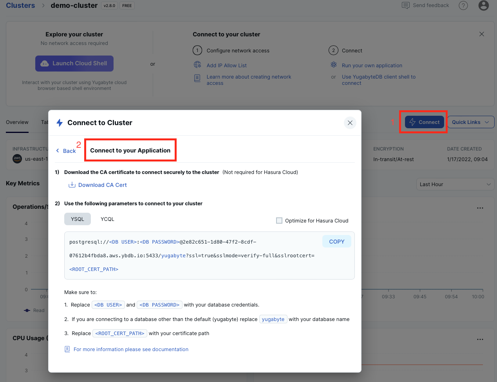

# Simple Node.js Application for YugabyteDB

This application connects to your YugabyteDB instance via the 
[node-postgres](https://node-postgres.com) module and performs basic SQL 
operations. The instructions below are provided for [YugabyteDB Managed](https://cloud.yugabyte.com/) deployments. 
If you use a different type of deployment, then update the `sample-app.js` file with proper connection parameters.

## Prerequisites

* The latest version of Node.js.
* Command line tool or your favourite IDE, such as Visual Studio Code.

## Start YugabyteDB Managed Cluster

* [Start YugabyteDB Managed](https://docs.yugabyte.com/latest/yugabyte-cloud/cloud-quickstart/qs-add/) instance. You can use
the free tier at no cost.
* Add an IP address of your machine/laptop to the [IP allow list](https://docs.yugabyte.com/latest/yugabyte-cloud/cloud-secure-clusters/add-connections/#manage-ip-allow-lists)

## Clone Application Repository

Clone the repository and change dirs into it:

```bash
git clone https://github.com/yugabyte/yugabyte-simple-node-app && cd yugabyte-simple-node-app
```

## Provide Cluster Connection Parameters

Open the `sample-app.js` file and edit the following configuration parameters:
* `host` - the hostname of your instance.
* `port` - the port number of the instance (the default is `5433`).
* `user` - the username for your instance.
* `password` - the database password.
* `ssl.ca` - a full path to your CA root cert. Replace the `path_to_your_root_certificate` placeholder with a path to your certificate (for example, `/Users/dmagda/certificates/root.crt`). 

Note, you can easily find all the settings on the YugabyteDB Managed dashboard:



## Run the Application

1. Install the [node-postgres](https://node-postgres.com) driver:
    ```bash
    npm install pg
    ```
2. Install the [async utility](https://github.com/caolan/async):
    ```bash
    npm install --save async
    ```
3. Run the application:
    ```bash
    node sample-app.js
    ```

Upon successful execution, you will see output similar to the following:

```bash
>>>> Connecting to YugabyteDB!
>>>> Connected to YugabyteDB!
>>>> Successfully created table DemoAccount.
>>>> Selecting accounts:
name = Jessica, age = 28, country = USA, balance = 10000
name = John, age = 28, country = Canada, balance = 9000
>>>> Transferred 800 between accounts.
>>>> Selecting accounts:
name = Jessica, age = 28, country = USA, balance = 9200
name = John, age = 28, country = Canada, balance = 9800
```

## Explore Application Logic

Congrats! You've successfully executed a simple Node.js app that works with YugabyteDB.

Now, explore the source code of `sample-app.js`:
1. `connect` function - establishes a connection with your cloud instance via the node-postgres driver.
2. `createDatabase` function - creates a table and populates it with sample data.
3. `selectAccounts` function - queries the data with SQL `SELECT` statements.
4. `transferMoneyBetweenAccounts` function - updates records consistently with distributed transactions.

## Questions or Issues?

Having issues running this application or want to learn more from Yugabyte experts?

Join [our Slack channel](https://communityinviter.com/apps/yugabyte-db/register),
or raise a question on StackOverflow and tag the question with `yugabytedb`!
